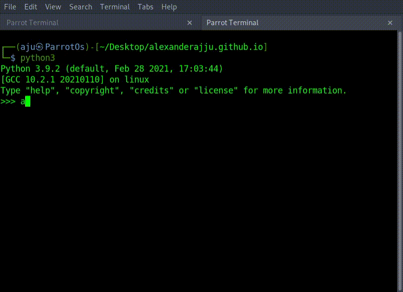

## Iterators

[Lists, tuples, dictionaries, and sets](./DataStructure.html) are all iterable objects. They are iterable containers which you can get an iterator from.

```diff
- All these objects have a iter() method which is used to get an iterator:
```

Iterators are everywhere in Python. They are elegantly implemented within for loops, comprehensions, generators etc. but are hidden in plain sight. Python iterator object must implement two special methods, `__iter__()` and `__next__()` collectively called the iterator protocol.

- The iter() function (which in turn calls the `**iter**()` method) returns an iterator from them.
- The next() function to manually iterate through all the items of an iterator. When we reach the end and there is no more data to be returned, it will raise the StopIteration

```python3

#Example 1

# define a list
my_list = [4, 7, 0, 3]

# get an iterator using iter()
my_iter = iter(my_list)

# iterate through it using next()

# Output: 4
print(next(my_iter))

# Output: 7
print(next(my_iter))

# next(obj) is same as obj.__next__()

# Output: 0
print(my_iter.__next__())

# Output: 3
print(my_iter.__next__())

# This will raise error, no items left
next(my_iter)

```

Iterators with datastructures

```python3


# Example 2

# lists
a = ['foo', 'bar', 'baz']
b = ['foo', 'bar', 'baz']
itra = iter(a)
itrb = iter(b)
print("itra: ",list(itra))
itra: ['foo', 'bar', 'baz']

# set
print("itrb ",set(itrb))
itrb: {'foo', 'baz', 'bar'}

```



# Loops

Python has two primitive loop commands:

- while loops
- for loops

## The while Loop

The while loop in Python is used to iterate over a block of code as long as the test expression (condition) is true.

```python3
# syntax
while test_expression:
    Body of while
```

In the while loop, test expression is checked first. The body of the loop is entered only if the test_expression evaluates to True. After one iteration, the test expression is checked again. This process continues until the test_expression evaluates to False.

<p align="center">
  
</p>

```python3
# Example 1

count = 0
while (count < 9):
   print 'The count is:', count
   count = count + 1

print "Good bye!"

# Output
The count is: 0
The count is: 1
The count is: 2
The count is: 3
The count is: 4
The count is: 5
The count is: 6
The count is: 7
The count is: 8
Good bye!

```

_A loop becomes infinite loop if a condition never becomes FALSE. You must use caution when using while loops because of the possibility that this condition never resolves to a FALSE value. This results in a loop that never ends. Such a loop is called an infinite loop._

**An infinite loop might be useful in client/server programming where the server needs to run continuously so that client programs can communicate with it as and when required.**

### The While Loop Else Clause

```python3

Example 2

#Print a message once the condition is false:

n = 5
while n > 0:
    n = n - 1
    if n == 2:
        break
    print(n)
else:
    print("Loop is finished")

#Output

1
2
3
4
5
i is no longer less than 6

```

## For loop

A for loop is used for iterating over a sequence (that is either a list, a tuple, a dictionary, a set, or a string).like the `for` keyword in other programming languages, and works more like an iterator method as found in other object-orientated programming languages. With the for loop we can execute a set of statements, once for each item in a list, tuple, set etc.

```python3
# synatx
for element in iterable:
    # do something with element
```

```python3

# Example 1

my_list = [1, 2, 3, 4]

for element in my_list:
    print(element)

1
2
3
4
```

## The break Statement

The break statement can be used to stop the loop before it has looped through all the items.

```python3

#Example 1

#Exit the loop when x is "banana":

fruits = ["apple", "banana", "cherry"]
for x in fruits:
  print(x)
  if x == "banana":
    break

```

### The range() Function

This type of `for` loop called a `numeric range loop`, in which starting and ending numeric values are specified.

```python3

#Example 1

for n in (0, 1, 2, 3, 4):
print(n)

0
1
2
3
4
```

[Top](#)

[Back](./contents.html)
